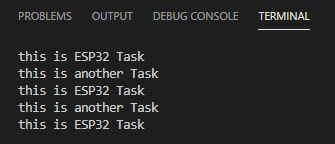

# PRACTICA 4: SISTEMAS OPERATIVOS EN TIEMPO REAL
## INTRODUCCIÓN RTOs i TAREAS:
En esta practica usaremos las tareas simultaneas que nos permiten que el processador haga mas de una ejeccucion a la vez permitiendo asi quna mejor eficiencia de los ciclos del processador i que no este pausado mientras se hace una cosa i la otra.

___

## Ejercicio 1:
En el primer ejecicio planteado nos pide que el codigo ejecute dos tareas que simplemente escriben en la terminal

-Codigo del ejercicio:
```
#include <Arduino.h>

void anotherTask( void * parameter );


void setup()
{
Serial.begin(112500);
/* we create a new task here */
xTaskCreate(
anotherTask, /* Task function. */
"another Task", /* name of task. */
10000, /* Stack size of task */
NULL, /* parameter of the task */
1, /* priority of the task */
NULL); /* Task handle to keep track of created task */
}
/* the forever loop() function is invoked by Arduino ESP32 loopTask */
void loop()
{
Serial.println("this is ESP32 Task");
delay(1000);
}
/* this function will be invoked when additionalTask was created */
void anotherTask( void * parameter )
{
/* loop forever */
for(;;)
{
Serial.println("this is another Task");
delay(1000);
}
/* delete a task when finish,
this will never happen because this is infinity loop */
vTaskDelete( NULL );
}
```
----
## Salida del puerto serie:
En el puerto serier se puestran los serial prints de las "dos" tareas con los mensajes"this is ESP32 task" i "this is another task" estos dos mensajes se van intercalando en base a las ejecuciones del bucle infinito que se explica mas adelante:

### imagen del serial port:


----
## Funcionamiento:
En el codigo podemos ver como creamos una nueva tarea dentro del setup() con la funcion xTaskCreate, alli definimos los parametros de la tarea como la stack size, la prioridad
etc...

```
Serial.begin(112500);
/* we create a new task here */
xTaskCreate(
anotherTask, /* Task function. */
"another Task", /* name of task. */
10000, /* Stack size of task */
NULL, /* parameter of the task */
1, /* priority of the task */
NULL); /* Task handle to keep track of created task */
}
/* the forever loop() function is invoked by Arduino ESP32 loopTask */

```

luego en el void loop() tenemos el serial print "this is ESP32 task" i justo despues un delay de 1000ms.

```
void loop()
{
Serial.println("this is ESP32 Task");
delay(1000);
}
```

luego esta declarada la funcion anothertask que es invocada quando se crea la tarea con la funcion xtaskcreate; dentro de la funcion hay un bucle infinito con el serial print de la tarea "this is another task" i otro delay.
```
void anotherTask( void * parameter )
{
/* loop forever */
for(;;)
{
Serial.println("this is another Task");
delay(1000);
}
```

En resumen las tareas escriben en la terminal de forma intercalada de forma que mientras una ejecuta su delay la otra escribe i viceversa. 


