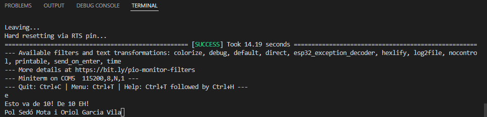

# PRÁCTICA 8: Buses de comunicación IV (uart):
## Codigo fuente:

```
#include <Arduino.h>

void setup() {
  Serial.begin(115200);
  Serial2.begin(115200);
}

void loop() {
  if(Serial.available()){
    Serial2.write(Serial.read());
    delay(2);
    if(Serial2.available()){
      Serial.write(Serial2.read());
    } 
  }
}
```

## Descricion:
Aqui se declara la libreria de arduino: 
```
#include <Arduino.h>
```
Iniciamos dos serial.begin dento del la funcion setup:
```
void setup() {
  Serial.begin(115200);
  Serial2.begin(115200);
}
```

En el loop, con el "serial.avaliable()" leemos por el puerto serie los caracteres que recojemos al monitorear el programa. Seguidamente con "Serial2.write(Serial.read())" escribiomos nuestro mensaje y seguidamente este sera leido por el primer serial. Ponemos también un delay para dejar un poco de tiempo al escribir. En la última condición consiste en que si se lee alguna cosa por el puerto serie se escribira también el mensaje y se leera por el serial2.

En el bucle principal usamos el metodo serial.available() para leer por puerto serie los caracteres que escibimos en la terminal i despues usamos otro metodo "serial2.write(Serial.read()) Escribimos por pantalla los caracteres que hemos recojido i los leemos por el primer serial, entonces esperamos con un delay i seguidamente con la ultima concición que si lee qualquier coda por el puerto serie lo escriba tambien en el segundo serial2
```
void loop() {
  if(Serial.available()){
    Serial2.write(Serial.read());
    delay(2);
    if(Serial2.available()){
      Serial.write(Serial2.read());
    } 
  }
}
```

## Salidas y entradas de consola:
por la salida del puerto serie se muestran los mismo caracteres que vamos escribiendo.

